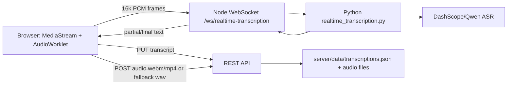

# Realtime Transcription Demo

一个从 Research Canvas 抽出来的实时转录最小可运行模块。

功能：

- 浏览器录音，AudioWorklet 输出 16k PCM。
- WebSocket 推送音频帧到 Node 后端。
- Node 后端启动 Python DashScope/Qwen ASR 服务。
- 实时显示 partial/final 转录。
- 停止时保存 transcript JSON 和录音文件。
- 如果浏览器 `MediaRecorder` 没有产出音频，会用已发送给 ASR 的 PCM 自动打包成 WAV 兜底保存。

不包含：

- 原项目的 Canvas、Portfolio、AI Process 其它业务。
- OAuth、GCS、Postgres、用户数据。
- 任何 API key 或历史录音。

## Quick Start

```bash
git clone <your-repo-url>
cd realtime-transcription-demo
cp .env.example .env
# 编辑 .env，填 DASHSCOPE_API_KEY

npm install
pip install -r server/python_service/requirements.txt
npm run dev
```

打开 `http://localhost:5173`。

## Environment

```env
DASHSCOPE_API_KEY=your_dashscope_api_key_here
PORT=8081
FRONTEND_URL=http://localhost:5173
DATA_DIR=./data
```

## Architecture



## API

- `GET /api/health`
- `GET /api/transcriptions`
- `GET /api/transcriptions/:id`
- `PUT /api/transcriptions/:id/save-text`
- `POST /api/transcriptions/:id/upload-audio`
- `GET /api/transcriptions/:id/audio`
- `WS /ws/realtime-transcription?model=qwen3-asr-flash-realtime&language=zh`

## Notes

- 默认模型是 `qwen3-asr-flash-realtime`。
- 也可以在前端选择 `paraformer-realtime-v2`。
- 本 demo 只做本地文件保存，部署生产时建议把 `server/data` 换成 S3/GCS/R2，并加认证。
- 不要把 `.env` 提交到 GitHub。

